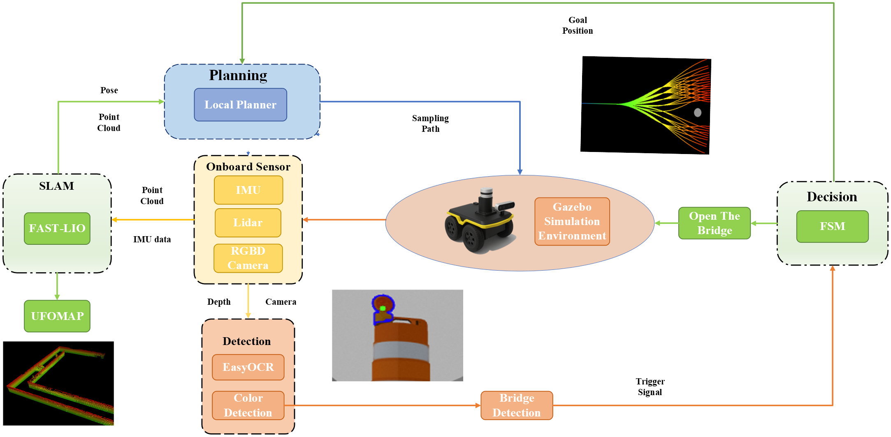
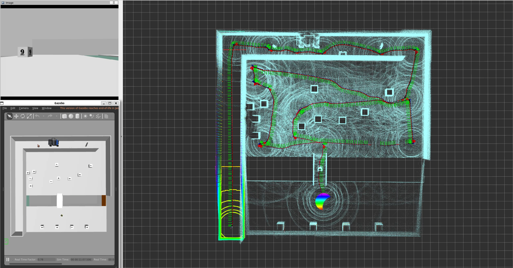

# ME5413_Final_Project - Group 8

NUS ME5413 Autonomous Mobile Robotics Final Project
> Authors: [CHENXIN](https://github.com/XinChen-stars), [ZHUYU](https://github.com/SkyPiggy8), [MAYUXUAN](https://github.com/XuaaanQWQ), [ZHAOYUNSHUO](https://github.com/Zhaoyer), [ZHANGBINLIN](https://github.com/zblamy), and [XIEYIKANG](https://github.com/YikangXie)





## Dependencies

* System Requirements:
  * Ubuntu 20.04
  * ROS Noetic
  * C++11 and above
  * CMake: 3.0.2 and above
* This repo depends on the following standard ROS pkgs:
  * `roscpp`
  * `rospy`
  * `rviz`
  * `std_msgs`
  * `nav_msgs`
  * `geometry_msgs`
  * `visualization_msgs`
  * `tf2`
  * `tf2_ros`
  * `tf2_geometry_msgs`
  * `pluginlib`
  * `map_server`
  * `gazebo_ros`
  * `jsk_rviz_plugins`
  * `jackal_gazebo`
  * `jackal_navigation`
  * `velodyne_simulator`
  * `teleop_twist_keyboard`
  * `easyocr`
* And this [gazebo_model](https://github.com/osrf/gazebo_models) repositiory

## Installation

This repo is a ros workspace, containing three rospkgs:

* `interactive_tools` are customized tools to interact with gazebo and your robot
* `jackal_description` contains the modified jackal robot model descriptions
* `me5413_world` the main pkg containing the gazebo world, and the launch files
* `Mapping` the main pkg containing the FAST-LIO, and the launch files
* `Navigation` the main pkg containing the Local-Planner, and the launch files
* `Perception` the main pkg containing the Barrel & Number Detection, and the launch files
* `FSM` the main pkg containing the FSM, and the launch files
* `3rdparty` the main pkg containing the Livox-SDK2 & livox_ros_driver2

To properly load the gazebo world, you will need to have the necessary model files in the `~/.gazebo/models/` directory.

There are three sources of models needed:

* [Gazebo official models](https://github.com/osrf/gazebo_models)
  
  ```bash
  # Create the destination directory
  cd
  mkdir -p .gazebo/models

  # Clone the official gazebo models repo (assuming home here `~/`)
  git clone https://github.com/osrf/gazebo_models.git

  # Copy the models into the `~/.gazebo/models` directory
  cp -r ~/gazebo_models/* ~/.gazebo/models
  ```

* [Our customized models](https://github.com/NUS-Advanced-Robotics-Centre/ME5413_Final_Project/tree/main/src/me5413_world/models)

  ```bash
  # Copy the customized models into the `~/.gazebo/models` directory
  cp -r ~/ME5413_Final_Project/src/me5413_world/models/* ~/.gazebo/models
  ```

* [Realsense RGBD camera]()

  ```bash
  sudo apt-get install ros-$ROS_DISTRO-realsense2-camera ros-$ROS_DISTRO-realsense2-description ros-$ROS_DISTRO-gazebo-plugins
  ```

There are two driver for FAST_LIO:

* [Livox-SDK2](https://github.com/Livox-SDK/Livox-SDK2)

  ```bash
  mkdir -p Autonomous_Jackal_ws/src
  cd Autonomous_Jackal_ws
  git clone https://github.com/XinChen-stars/Autonomous_Jackal.git
  mv Autonomous_Jackal/* src/
  rm -rf Autonomous_Jackal/
  unzip src/3rdparty.zip -d ./  
  cd 3rdparty/Livox-SDK2/  
  mkdir build
  cd build
  cmake ..
  make -j8
  sudo make install
  ```

* [livox_ros_driver2](https://github.com/Livox-SDK/livox_ros_driver2)

  ```bash
  cd Autonomous_Jackal_ws/src
  mkdir Mapping
  cd ../
  cp -r 3rdparty/livox_ros_driver2/ src/Mapping/  
  cd src/Mapping/livox_ros_driver2
  ./build.sh ROS1
  ```

* [FAST_LIO](https://github.com/hku-mars/FAST_LIO)

  ```bash
  cd Autonomous_Jackal_ws/
  cp -r 3rdparty/FAST_LIO src/Mapping/
  catkin_make
  ```

Dependence for Perception:

* [EasyOCR](https://github.com/JaidedAI/EasyOCR)
  ```bash
  pip install easyocr
  ```


**Note:** Please intall the Livox-SDK2 & livox_ros_driver2 before install the FAST-LIO !!!

## Usage

### 0. Gazebo World

This command will launch the gazebo with the project world

```bash
# Launch Gazebo World together with our robot
roslaunch me5413_world world.launch
```

### 1. Mapping

```bash
# Launch fast_lio 
roslaunch fast_lio mapping_velodyne.launch
```

### 2. Navigation

```bash
# Launch local planner
roslaunch mission_fsm jackal_navigation.launch
```

### 3. Perception

```bash
# Launch Barrel & Number detection
roslaunch mission_fsm jackal_detection.launch
```

### 4. FSM
```bash
# Launch mission fsm
roslaunch mission_fsm jackal_fsm.launch
```
## Acknowledgement
We would like to thank the following open-source projects:

- [Fast-LIO](https://github.com/hku-mars/FAST_LIO) for localization
- [EasyOCR](https://github.com/JaidedAI/EasyOCR)
- [cmu_planner](https://github.com/jizhang-cmu/ground_based_autonomy_basic) for local_planner and terrain_analysis